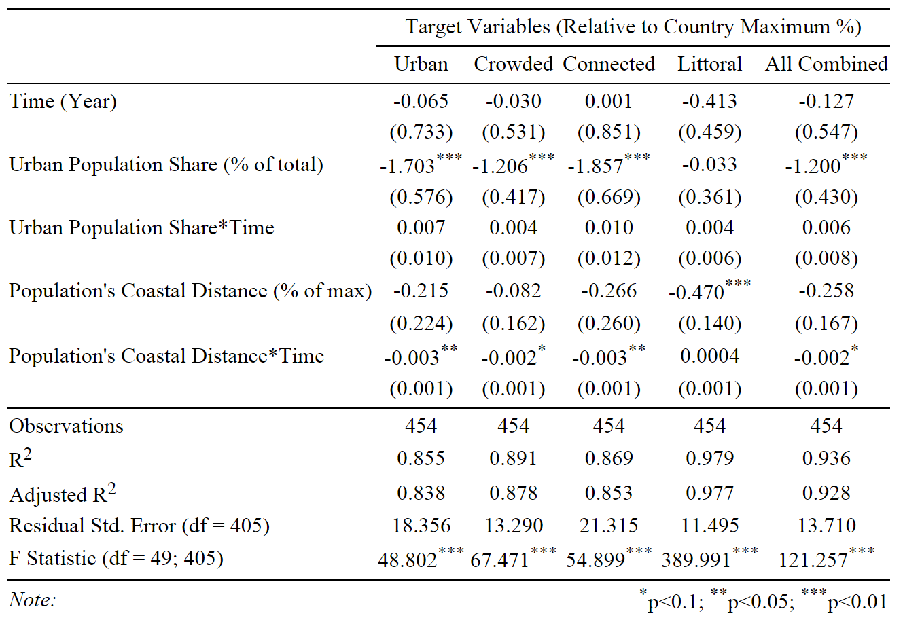

```{r, echo=FALSE, message=FALSE, warning=FALSE, cache=FALSE, results='asis'}
#Loading required packages
source("0 - Loading Packages.R", chdir=FALSE)
PreGTD <- read.csv("TerrorData/pregtd.csv")
```


# Introduction
In the past five years, violent extremist groups have attracted significant attention using urban centers as stages. In 2008, Pakistan-based Lashkar-e-Taiba launched a coordinated assault on Mumbai, which lasted three days and resulted in 164 civilian deaths. In 2013, Somalia-based Al-Shabaab infiltrated the Westgate mall in Nairobi, Kenya, killing 67 and injuring 175 civilians.  Terrorist groups are a considerable threat to vulnerable cities.  In both cases, the groups exploited with relative ease the complex flow of systems in the city to achieve desired outcomes. This sparked a debate about extremist groups targeting practices, as well as how to locate, understand, protect against, and mitigate attacks in the face of megatrends like urbanization, population growth, migration, and increasing interconnectedness. The urban environment emerges as a unit of analysis for acts of political violence. 


Future conflicts are expected to take place in crowded, urban, coastal and connected environments instead of landlocked, remote and rural ones. Especially megacities present fertile grounds for inequality and conflict, as well as the most connected, large, yet vulnerable human and physical sub-system for terrorist attacks.  Since 9/11, the fields of geography, urban studies, political science, and many others have contributed to the understanding of terrorist attacks, strategic decision-making, and geospatial aspects of targeting behavior. We aim to undertake a large-N pattern analysis using the Global Terrorism Database [@START2013] to illuminate trends in targeting behavior.  Our study aims to fill a gap: Is there a trend for terrorists to target urban over rural environments?


We use a large-N pattern analysis to investigate predicted trends in terrorism as stated by David Kilcullen [-@Kilcullen2013]. Do we find evidence that terrorists in fact have shifted or will shift towards urban environments? We will use the terrorism loosely in this paper, but we intend to investigate outbursts of political violance and its implications writ large. The Global Terrorism Database allows for defining terrorism in the broad sense due to respective variables on the perpetrator characteristics and intentions. 


This paper proceeds as follows. First, we conduct a literature review on terrorism trends vis-vis the urban space. We then introduce the operationalization of our variables, and then describe our data collection and cleaning process. After that, we visualize part of our approach through a number of example attacks. Then, we describe our analysis setup before finally presenting our findings.


**Note:** The state of this project right now is a final exam for the class "Collaborative Social Science Data Analysis", taught by Christopher Gandrud at the Hertie School of Governance in the Fall 2014 Semester. Cleaning, Manipulation, and Analysis for the project remain preliminary. We hope to clean more observations and derive more hypotheses in the future with the goal of making the final project part ouf our master thesis. Our future focus will rest on improved analysis, including on the perpetrator group level.

-------

# Literature Review

## General

Urban terrorism is by no means a new concept, as it arises in guerilla, riot, and insurgency literature [@Crenshaw1981; @Grabosky1979; @Grabosky1988; @Karber1971; @Laqueur1977; @Lupsha1967].  Indeed, the urban context was a feature of Walter Laquer's early study on guerilla warfare. Groups like the Mau Mau of Kenya, the Irish Republican Army, and the Front de Liberacion Nationale employed tactics against colonial powers that exhibited characteristics of urban life and space [@Laqueur1977].  Martha Crenshaw's seminal piece on the causes of terrorism highlighted the enduring importance of modernization and urbanization, which she saw as an ever growing opportunity for terrorist groups to execute attacks [@Crenshaw1981]. Others highlight the urban space as a ground for recruitment, hiding and communication, as well as the variety of possible targets [@Grabosky1979].  Most of the literature leading up to 9/11 recognized the urban element, but did not fully address linkages between urbanization and (state) security.


The literature studies various explanations for targeting practices, such as instrumental means, i.e., resources and capabilities driving strategy, organizational survival, management, human resources, and funding constraining strategic decisions, or ideological and religious motivation.  More specifically, targeting behavior has been growing in importance in terrorism literature due to its policy relevance and potential for prediction.  Martha Crenshaw has shed light on how groups shape motivations behind targeting, such as religiosity, communal ties, or other less tangible, intrinsic motivations [@Crenshaw1981].  Todd Sandler built strategic game theory models that parse potential decisions with constraints of resources and capabilities taken into consideration [@Enders2000].  Others believe that organizational survival drives decisions, such as Jacob Shapiro's economic insights into how covert organizations are limited by their ability to fund operations, linking his work to the broader literature on rational choice [@Shapiro2007].  Finally, scholars have thoroughly explored characteristics of organizations that elongate or decline lifespans, including analysis of favorable conditions for organizational survival [@Blomberg2011].  Of course, these theories are not mutually exclusive and they collectively strengthen the understanding of strategic considerations in terrorist decision-making.


However, few theories of strategy take into consideration geospatial aspects or variation in targeting behavior.  Consider the following questions.  Does the organization want to control territory?  Or do they rather want to make a point, provoke a government in the realm of national symbolism, or attract attention?  Apart from explaining internal factors of the organization, we can attempt to explain geography-bound terrorism, such as considerations of spatial and hierarchical diffusion, currently nascent in the literature on terrorist group dynamics [@Bahgat2013].  Spatial diffusion refers to one base of operations close to a series of attacks, whereas hierarchical diffusion is the existence of several hot spots from which attacks emanate.  These phenomena are supported by findings on geolocated IRA attacks in Northern Ireland and Great Britain.  The difference here in spatial and hierarchical diffusion refers to a growing sense-making literature on the spatial logic of terrorism, but also growing importance of, as Bahgat and Medina put it, how cities of high population and administrative worth to the government appear to have become the main targets of modern-day terrorism for a variety of strategic and cost-effective reasons [-@Bahgat2013].  


Prominent theorists of conflict re-problematize the issue, taking into consideration megatrends of urbanization, population growth and connectedness. Megacities are their unit of analysis for studying conflict [@Kilcullen2013]. Geographers have offered a research agenda for their field in the face of the rising importance of the ancient social phenomena of terrorism [@Cutter2003]. It is often assumed that growing and developing urban environments become increasingly attractive as targets for violent extremists, resulting in more attacks on urban systems, but mostly single case studies like in the Mumbai 2008 case are referenced in support of that claim--larger empirical studies are rare [@Beall2006; @Glaeser2002; @Graham2008; @Sassen2010; @Savitch2001]. It said to be a traditional characteristic of terrorism studies that much is written on the basis of little empirical analysis [@Jongman1988]. To our knowledge, a comparable study exists only on the geolocation of terror attacks on the U.S. level [@Webb2009]. One working paper has used the GTD to study urban vs. rural targets locations, but used a time invariant measurement of infrastructure complexity as proxy of urbanity [@Kaisa2013].


Our main source of data, The Global Terrorism Database (GTD) has been employed in different fields and various ways to study terrorism. Also, it has been used to study specific categorical phenomena or regions, e.g, hostage-taking or weapon types, as well as sweeping trends, such as casualty rates due to terrorist attacks.  The research methods followed include geographical mapping, descriptive statistics, and qualitative inquiry [@LaFree2009a].

There are essentially three camps of researchers in the applied fields using the GTD:

  1. Political Science/International Relations
  2. Terrorism Studies
  3. Geography

In most of the cases, there is a convergence of the three, albeit to different extents.  For example, geographers use the data to make sense of geospatial path dependencies of terrorist groups and social network analysis (physical and human geography), whereas political scientists undertake more rigorous qualitative analysis.  Often, terrorism scholars will focus on one category, region, group, or trajectory.  LaFree is producing the most comprehensive review of uses of the GTD, which comes out in 2015.  He also has written extensively on how to use the GTD to counter widely held beliefs regarding terrorism [@LaFree2009].  Correlation work between terrorism and economic, legal, or group characteristic data also exists [@LaFree2010].  This body of work might be viewed as functional.  Geospatial analysis of these trends gained traction after 9/11 and have since been growing in importance and policy relevance.  Operating under the assumption that large-scale attacks are planned, geospatial analysis, or mapping other types of analysis onto geographical illustrations, provide insights into strategies of targeting and decision-making.  In fact, applied geographers have discovered trends in the environment that signal a trend toward targeting areas with high populations [@Bahgat2013; @Kaisa2013].  


In 2013, David Kilcullen contributed a highly influential book on new trends in terrorism [@Kilcullen2013]. Using a spatial approach, Kilcullen offers a three-pronged theoretic setup to predict the new trends in terrorism. For him, the change in targeting trends is related to a shift of the targeting environment. Terrorism, he argues, will move from landlocked, distant, and rural places to littoral, connected, crowded and urban ones.


By stating that terrorism will move into new environments, Kilcullen aims to account for a change significantly faster than existing global trends. Since there is a general trend for people to move to urban environments we would naturally expect political violence to move with the people. Kilcullen's meaning of a change of environment however does more than just accounting for the global trend towards urbanity. He predicts an increase in terrorism in urban environments that is faster than the overall trend for urbanity.

------------


# Variable Operationalization

Our analysis is inherently time based. Nevertheless, time is not our single independent variable. We also internalize the global trends towards urbanity and littoralness in our independent variable and estimate their effect on attacks in urban/crowded/connected/littoral environments.


We use country-based relative community-level data and analyze attacks taking place in communities ranging from small cities to the megalopolis and relate them to their peers in the same country ("city", "location", and "community" are used interchangeably in this paper). Our dependent variables are all normalized and calculated as a relative to their country maximum/minimum in every year. 


We gathered as much of our data for all years of observations. Some data was not available in a yearly basis and where possible, we interpolated missing information from single data points we were able to collect over time. Since we conduct our final analysis on a dataset ranging from 1998 - 2013, we estimate the resulting bias to be negligible.


## Dependent Variables

**DV.Target.Urban:** Attacks in Urban Environments. We measure Urbanity by including:

  * City Rank: city's relative rank-size (population) as a log size according to the rank-size rule (time variant)
  * City Population: city's relative population (time variant)
  * Community's Urban Landcover: percentage of relative sealed surfaces (not time variant)
  * Location's Night Lights: community's stable nightly emanation of artificial light (not time variant)
  
  
**DV.Target.Crowded:** Attacks in Crowded Environments. We measure Crowdedness by including:

  * Location's Population Density (time variant)
  * Location's Population Density Growth: relative over past years (time variant)
  * Night Light Development Index: relative equality using night light distribution within communities (not time variant)
  
**DV.Target.Connected:** Attacks in Connected Environments. We measure Connectedness by including:

  * Proximity: relative travel time to closest large city (not time variant)
  * Location's Nightlights: community's nightly emanation of light (not time variant)
  * Location's GDP: relative share of GDP (not time variant)

**DV.Target.Littoral:** Attacks in Coastal Environments. We measure Coastalness by including:

  * Proximity to Coast: landlocked countries are NA (not time variant)
  
**DV.Kilcullen:** a simple aggregation of all of the above


## Independent Variables

**IV.Time:** year from 1998 (0) to 2013 (15)

**IV.Urban.Share:** total share of country's population living in urban environments

**IV.Urban.Share_Year:** interaction variable

**IV.Pop.Coastal.Dist:** country's population average proximity to the coast

**IV.Pop.Coastal.Dist_Year:** interaction variable

-------------


# Data

## Data Sets
### Global Terrorism Database (GTD) 

We use the START Global Terrorism Database [@START2013] (GTD), as it is the most comprehensive open source database on terrorist attacks [@LaFree2006].  The data ranges from 1970-2013, records 125,000 terrorist attacks, and uses 45 - 120 variables per attack.  Among other information, the GTD holds records on the location, the target, and the damage caused by attacks [@START2014]. It is a simple .xls file, available after creating an account on the GTD Projects website and it is already ready for .csv transformation, as close to no excel functions are layered over the data entry. It contains both numeric and factor variables for describing the attacks characteristics. All categorical variables have both categorical numbers and a respective text variable for each number. This creates a lot of redundant information and needs much tidying.


The current GTD is the product of several phases of data collection efforts, each relying on publicly available, unclassified source materials.  These include media articles and electronic news archives, and to a lesser extent, existing data sets, and secondary source materials such as books, journals, and legal documents [@START2014]. We are aware of the intertwined problems of reliability and comparability.


The original set of incidents that comprise the GTD occurred between 1970 and 1997 and were collected by the Pinkerton Global Intelligence Service (PGIS), a private security agency.  PGIS data collection efforts are remarkable in that they were able to develop and apply a similar data collection strategy for a 28-year period [@LaFree2006]. After the University of Maryland's Institute for the Study of Terrorism and Responses to Terrorism (START) completed digitizing these handwritten records in 2005, they collaborated with the Center for Terrorism and Intelligence Studies (CETIS) to continue data collection beyond 1997 and expand the scope of the information recorded for each attack [@START2014]. CETIS collected GTD data for terrorist attacks that occurred from January 1998 through March 2008, after which ongoing data collection transitioned to the Institute for the Study of Violent Groups (ISVG). ISVG continued as the primary collector of data on attacks that occurred from April 2008 through October 2011.


GTD staff based at START headquarters (University of Maryland) integrated and synthesized data collected across the entire 1970-2013 time span with the goal of ensuring that the definitions and methodology are as consistent as possible across all phases of data collection. In addition, GTD staff at START retroactively coded several key variables not originally available for the PGIS cases, conducted numerous quality control projects, and supplemental data collection efforts. These supplemental data collection efforts involve systematically comparing a variety of additional sources of terrorism incident data to the GTD to identify any missing events that satisfy GTD inclusion criteria. Beginning with cases that occurred in November 2011, all ongoing GTD data collection is conducted by START staff at the University of Maryland. Additional information on the history and data collection methodology of the database can be found on the GTD website [@START2014].


Given the varied context of GTD data collection, the database is another source of general inconsistency--legacy problems.  The GTD now includes incidents of terrorism from 1970 to 2013, however a number of new variables were added to the database beginning with the post-1997 data collection effort. The year 1993 is missing entirely. Wherever possible, values for these new variables were retroactively coded for the original incidents, however some of the new variables pertain to details that were not recorded in the first phase of data collection.  For any newly added variables that were not retroactively coded, they only exist for post-1997 cases. The GTD is based on PGIS, and PGIS is the most granular and comprehensive. 


### Country Level Data

**a.** Our source for population related country-level data is the set of [World Development Indicators (WDI)](http://data.worldbank.org/data-catalog/world-development-indicators) provided by the World Bank. We download them using the [WDI package for R](http://cran.r-project.org/web/packages/WDI/WDI.pdf), a shortcut to the World Bank's API that provides data already formatted in long country-year format [@WDIpackage].

**b.** We use data from wiki's worldgrids for our estimate on urbanity related factors: The nightline development index, surface sealing, population density, road accessability, coastal proximity. [@worldgrids]

### City Level Data

**a.** "world.cities" from the [R package 'maps'](http://cran.r-project.org/web/packages/maps/maps.pdf). The database "is primarily of world cities of population greater than about 40,000. Also included are capital cities of any population size, and many smaller towns." [@mapspackage] The variables include the city name, country name, approximate population (as of January 2006), latitude, longitude, and capital status indication. 

**b.** "worldcities2013" from [MaxMind Inc.](https://www.maxmind.com/en/worldcities)[@worldcities]. This data set provides similar information, but is updated more regularly. 

**c.** "Urban Centers" from wikipedia. In the absence of a free data set on urban centers, we scraped a list with around 500 urban centers (>1 million inhabitants) of the [respective Wikipedia page] (http://en.wikipedia.org/wiki/List_of_urban_areas_by_population)[@wikiUCs]. It draws from seven different types of sources and is put together in terms of defining urban space and urban centers. We added a hand-coded "coastal city" variable to indicate if a city is close to the coastline and has a port.


### Additional Control Variables

**a. Civil War** We include civil war dummy variables because civil wars are likely to exponentially increase the amount of terror attacks in a given year and city. It comes from the [Correlates of War](http://www.correlatesofwar.org/) project and is called the Intra-State War Database 4.0 [@COW]. 

----------


##Data Cleaning

###Challenges in All the Data Sets

**Missing Information:** None of the datasets used can be considered complete with regard to the individual observations. In fact, they contain a huge number of missing values. We aim not to have a drastically increased share of missing values in the dataset used for the final analysis. All datasets are very comprehensive and stem from sources with high reputation. An extensive cleaning process was necessary nonetheless. 

**Spelling Inconsistencies:** The main challenge across and within all datasets is the huge variation in spelling of countries and cities, which triggered an extensive hand recoding process. We developed a standardized style for country and city names and applied that to all data sets. 

 - GTD ~ 120k rows
 - cities.a. ~ 60k rows
 - cities.b. ~ 100k rows
 - Urban Centers ~ 500 rows

**Coding Gaps, Information Inconsistencies, and Lack of Detail:** All datasets containing georeferenceable data contained this information on varying scales and for different time periods. For example, while some attacks in the GTD were probably geolocated using GPS guidance, others lack their own geoposition and are only presented using the central point of the city or district. When possible, we tried to define position data. 


A huge gap existed between the WDI data and the GTD. The GTD assigns attacks to the countries they took place in at the time they happened. However, these countries (Soviet Union, Yugoslavia, GDR, etc.), in some cases, do not exist anymore. The WDI, on the other hand, contains country-level data dating back to 1960 in the form of countries as they are today. 


##Data Cleaning Process

We brought all country names to the standard of the World Bank data both to act as a point of reference and because we will draw most of our country level data from there. 


Although we combine the two world city datasets, we decided not to bring the city names to the same standard before merging them into our version of the GTD. This has to do with the sort and amount of inconsistencies mentioned above: the more (even inconsistent, wrong, or outdated) city names we have in the world city datasets, the higher our chances to match them with cities mentioned in the GTD (even if by the coincidence of matching typos that we may have overlooked). 


Because of the abysmal quality of the city_txt variable in the GTD, at least 1500 city names had to be reassigned by hand, after running automated processes. Codings like "somewhere at the border" or up to 10 typos (from "Buen%%s Eir$" to "Buenos Aires") for a heavily targeted city are not unusual.  


##Merging Process

Apart from merging city and country level data with the GTD, we merged the urban center dataset with the now combined city dataset, assigning each city to its nearest urban center. The reasoning behind this step is that, while we have around 50k different cities in our GTD, only a share of them fulfills the requirement of being "urban" the way we understand it. A small or big distance between the city the attack took place and its closest urban center may serve as a rudimentary indicator for an intent to attack that urban center itself. Some large cities basically consist of a number of smaller ones that grew together over time, and we can account for that. 


Therefore, we include lat/long data for each urban center using the google maps API. Then, the distance from each urban center to each city was calculated. The merged dataset assigns the closest urban center to each city (and the respective distance). The necessity comes from the way cities are coded in the GTD. While an attack on Tokyo, a large city rarely attacked, is usually coded using "Tokyo", attacks in highly targeted cities are usually localized more precisely, i.e., assigned to districts. Good examples for this phenomenon are Lima, or the urban area around Tel Aviv. Both are attacked often and the GTD delivers predominantly the sub-municipality as the place of attack. We fixed that for the purpose of this study. 


With the new dataset, we can set a parameter of distance around each urban center (as a place holder we currently use $2*sqrt(urban-centers-area/pi)$, and later decide to count any attack that falls into that parameter as an attack on the urban center itself. If the GTD codes "New York City", it finds both the urban center and the city - but as the GTD sometimes codes "Manhattan", we now have a match on the urban center "New York City" as the distance between the two falls within our parameter. 


Finally, we merge our GTD and the combined city-urbancenter dataset. We use a merging variable, which is a clean character string in the form of *countrynamecityname* in order to avoid false positives of similar city names across countries. Due to our previously unified country and city coding in all datasets, we find a city (thus, population size and also closest urban center) for around 70% of all 120k terror attacks in the GTD. As the GTD often lacks any city name and has "unknown" or area codings (e.g. "District xyz"), 70% is a satisfying result given complexity and resource constraints. 


----------


# Visualization

To illustrate our approach, we have selected a subset of example attacks, which are included in our analysis. We also show several maps of the country in which the attacks took place (Turkey) to illustrate the distribution of attacks in different degrees of urban, connected, crowded, and coastal environments.

## Example attacks

These are 10 selected attacks in Turkey from 1998 to 2013 in different environments. Apart from human damage (number of killed and wounded), we also display the relative share of nightline, access to roads, and proximity to coasts compared to the rest of the cities in Turkey on a level from 0 - 100.

**Table.1** Example Attacks in Turkey
```{r, echo=FALSE, message=FALSE, warning=FALSE, cache = TRUE, results='asis'}

Rmdattacks <- read.csv("Rmdattacks.csv")

knitr::kable(Rmdattacks, format = "markdown")
```


**Attack Summaries** [@START2013]

 * 2003-11-14, Istanbul: Two car bombings by the militant Islamic group, Great East Islamic Raiders Front (IBDA-C - Islami Buyuk Dogu Akincilar Cephesi), on synagogues in Istanbul, Turkey, killed at least twenty people and injured 302 others. One of the two almost simultaneous blasts occurred at the Beth Israel Synagogue, damaging the building and several cars. Numerous people were reportedly killed and injured in the bombing. The group identified itself in a telephone call to the Anadolu News Agency.

 * 2008-07-27, Istanbul: On Sunday, two bombs exploded minutes apart in one of Istanbul's busy shopping districts on the European side. Though the Kurdistan Workers Party denied responsibility for the attack, officials continually accuse them of direct involvement.
 
 * 1999-07-30, Gurpinar: A total of four village guards were killed in Gurpinar, Turkey, when a group of perpetrators attacked the guards who were protecting the Telekom employees. Officials reported that the employees were the target of this attack.
 
 * 1999-03-05, Cankiri: A car bomb attack targeted the Cankiri Provincial Governor, Ayhan Cevik, while he was driving in Cankiri, Turkey. Four people were killed and the Governor and nine others were wounded. The Turkish Workers and Peasants Liberation Army (TKP/ML-TIKKO) claimed responsibility for the attack.
 
 * 2003-08-01, Ankara: An unnamed leftist organization detonated an explosive device in the garden of the Justice Ministry's Center of Education for Judge and Prosecutor Candidates in Ankara, Turkey. Eleven people, including policemen and judges, were injured in the explosion. Although a group claimed responsibility for the attack, Turkey's Interior Minister, Abdulkadir Aksu, did not publicly reveal the perpetrator group's name.
 
 * 1998-11-27, Kirikkale: A bomb exploded on a bus near Kirikkale, Turkey. The explosion killed four passengers and injured 20 others. The bomb was placed in the luggage department of the bus. There was no claim of responsibility for this attack.

 * 1999-10-18, Bademli: Unknown perpetrators set a Greek citizen's house on fire in the village of Bademli on Gokceada island, Turkey. A small child died in the fire.
 
 * 1998-09-09, Kuyucak: In one of two related attacks, rebels from the Kurdistan Workers Party (PKK) attacked the Imamli settlement unit in the village of Kuyucak, Turkey, killing one person and injuring three (Mustafa, Hilmi and Nuriye Atici). The perpetrators fled after this incident.
 
 * 2006-08-28, Antalya: Four people were killed and approximately 65 were injured when a bomb attached to a motorcycle detonated in Antalya, Turkey. No one claimed responsibility for the attack.

 * 2006-08-28, Antalya: A car filled with explosives exploded 80 meters from the Russian Consulate General in Antalya, Turkey, killing three people and wounding at least 20 more. No one claimed responsibility for the attack, but authorities believed the Kurdish separatists were to blame.
 
## Map Visualisation

**Figure 1:** Illumination levels in Turkey and example attacks

```{r, echo=FALSE, message=FALSE, warning=FALSE, cache = FALSE}
# Show lightmap
unzip("Downloaded_Data/Downloaded_Raster_Data.zip", exdir="Downloaded_Data")
unlink("Downloaded_Data/NLDI_2006_0p25_rev20111230.tif")
unlink("Downloaded_Data/GDP_grid_flt.tif")
unlink("Downloaded_Data/DICGSH1a.tif")
unlink("Downloaded_Data/GACGEM2a.tif")
unlink("Downloaded_Data/G19ESA3a.tif")
RASTERlight<- raster("Downloaded_Data/LNMDMS2a.tif")
#crop Raster to Turkey maps boundaries
e <- extent(27.9, 34.9, 36.2, 41.7)
LightLayer <- crop(RASTERlight, e)
#convert to usable dataframe including eliminating minor light values and aggregating the rest from 63 to only 6 levels
LightLayer <- as(LightLayer, "SpatialPixelsDataFrame")
LightLayer <- data.frame(LightLayer)
rm(RASTERlight, e)
unlink("Downloaded_Data/LNMDMS2a.tif")
colnames(LightLayer) <- c("light", "longitude", "latitude")
LightLayer$light <- as.numeric(LightLayer$light)
LightLayer <- subset(LightLayer, light > 3)
LightLayer$light <- recode (LightLayer$light, "4:10 = 1; 11:20 = 2; 21:30 = 3; 31:40 = 4; 41:50 = 5; 51:63 = 6", as.numeric.result=TRUE)

LightMap <- BaseMap + geom_tile(aes(x = longitude, y = latitude, fill=light), data = LightLayer, alpha = 0.7) +
            geom_point(aes(x=longitude, y=latitude, shape = inUC, color = inUC), data = ExA, size = 5 ) +
            scale_fill_gradient(low = "darkblue", high= "lightblue") +
            theme(legend.position="none") + 
        geom_text(aes(x=longitude+0.3, y=latitude+0.08, fontface="bold", color = inUC, fontsize = 5), data=ExA, label=ExA$Date) +
            scale_colour_manual(values = c("firebrick","pink"))
rm(LightLayer)

LightMap
```


---------


**Figure 2:** Road accessibility in Turkey and example attacks

```{r, echo=FALSE, message=FALSE, warning=FALSE, cache = FALSE}
# Show Accessmap
unzip("Downloaded_Data/Downloaded_Raster_Data.zip", exdir="Downloaded_Data")
unlink("Downloaded_Data/NLDI_2006_0p25_rev20111230.tif")
unlink("Downloaded_Data/GDP_grid_flt.tif")
unlink("Downloaded_Data/DICGSH1a.tif")
unlink("Downloaded_Data/G19ESA3a.tif")
unlink("Downloaded_Data/LNMDMS2a.tif")
RASTERAccess<- raster("Downloaded_Data/GACGEM2a.tif")
#crop Raster to Turkey maps boundaries
e <- extent(27.9, 34.9, 36.2, 41.7)
AccessLayer <- crop(RASTERAccess, e)
#aggregating cells because else, way too muh values
AccessLayer <- raster::aggregate(AccessLayer, fact=2, fun=mean, na.rm=TRUE)
#convert to usable dataframe including eliminating largest Access time values (in minutes ) and aggregating the rest to 10 min intervals
AccessLayer <- as(AccessLayer, "SpatialPixelsDataFrame")
AccessLayer <- data.frame(AccessLayer)
unlink("Downloaded_Data/GACGEM2a.tif")

rm(RASTERAccess, e)

colnames(AccessLayer) <- c("AccessTime", "longitude", "latitude")
AccessLayer$AccessTime <- as.numeric(AccessLayer$AccessTime)

#subsetting and binning Access Time values to 10 minute bins to reduce observations. N
#ow, only displaying areas that have Access Time < 120 minutes
AccessLayer <- subset(AccessLayer, AccessTime < 120)
AccessLayer$AccessTime <- AccessLayer$AccessTime/10
AccessLayer$AccessTime <- round(AccessLayer$AccessTime)

AccessMap <- BaseMap + geom_tile(aes(x = longitude, y = latitude, fill=AccessTime), data = AccessLayer) +
            geom_point(aes(x=longitude, y=latitude, shape = inUC, color = inUC), data = ExA, size = 5 ) +
            scale_fill_gradient(low = "lightblue", high= "darkblue") +
            theme(legend.position="none") + 
            geom_text(aes(x=longitude+0.3, y=latitude+0.08, fontface="bold", color = inUC, fontsize = 5), data=ExA, label=ExA$Date) +
            scale_colour_manual(values = c("firebrick","pink"))
rm(AccessLayer)
AccessMap
```


----------


**Figure 3:** Distance to coast of locations in Turkey and example attacks

```{r, echo=FALSE, message=FALSE, warning=FALSE, cache = FALSE}
# Proximity to Coast
unzip("Downloaded_Data/Downloaded_Raster_Data.zip", exdir="Downloaded_Data")
unlink("Downloaded_Data/NLDI_2006_0p25_rev20111230.tif")
unlink("Downloaded_Data/GDP_grid_flt.tif")
unlink("Downloaded_Data/GACGEM2a.tif")
unlink("Downloaded_Data/G19ESA3a.tif")
unlink("Downloaded_Data/LNMDMS2a.tif")

RASTERCoast<- raster("Downloaded_Data/DICGSH1a.tif")

#crop Raster to Turkey maps boundaries
e <- extent(27.9, 34.9, 36.2, 41.7)
CoastLayer <- crop(RASTERCoast, e)

CoastLayer <- as(CoastLayer, "SpatialPixelsDataFrame")
CoastLayer <- data.frame(CoastLayer)

rm(RASTERCoast, e)
unlink("Downloaded_Data/DICGSH1a.tif")

colnames(CoastLayer) <- c("Coastdist", "longitude", "latitude")
CoastLayer$Coastdist <- as.numeric(CoastLayer$Coastdist)
#reducing No of observations to on-coast and less than a 100 km from coast
CoastLayer <- subset(CoastLayer, Coastdist <=0 & Coastdist >=-100)
CoastLayer$Coastdist <- CoastLayer$Coastdist*-1


CoastMap <- BaseMap + geom_tile(aes(x = longitude, y = latitude, fill=Coastdist), data = CoastLayer, alpha=0.7) +
            geom_point(aes(x=longitude, y=latitude, shape = inUC, color = inUC), data = ExA, size = 5 ) +
            scale_fill_gradient(low = "lightblue", high= "darkblue") +
            theme(legend.position="none") + 
          geom_text(aes(x=longitude+0.3, y=latitude+0.08, fontface="bold", color = inUC, fontsize = 5), data=ExA, label=ExA$Date)+
            scale_colour_manual(values = c("firebrick","pink"))

CoastMap
```


--------


**Figure 4:** Population density in Turkey and example attacks

```{r, echo=FALSE, message=FALSE, warning=FALSE, cache = FALSE}
# Population Density
# Data sourced from http://neo.sci.gsfc.nasa.gov/servlet/RenderData?si=875430&cs=rgb&format=TIFF&width=3600&height=1800 and saved to Downloaded_Data
RASTERDens <- raster("Downloaded_Data/SEDAC_POP_2000-01-01_rgb_3600x1800.TIFF")
#crop Raster to Turkey maps boundaries
e <- extent(27.9, 34.9, 36.2, 41.7)
DensLayer <- crop(RASTERDens, e)

DensLayer <- as(DensLayer, "SpatialPixelsDataFrame")
DensLayer <- data.frame(DensLayer)

rm(RASTERDens, e)

colnames(DensLayer) <- c("Density", "longitude", "latitude")
DensLayer$Density <- as.numeric(DensLayer$Density)
#For whatever reason 255 is like NA, e.g. the sea
DensLayer <- subset(DensLayer, Density <255)
DensMap <- BaseMap + geom_tile(aes(x = longitude, y = latitude-0.1, fill=Density), data = DensLayer, alpha=0.7) +
           geom_point(aes(x=longitude, y=latitude, shape = inUC, color = inUC), data = ExA, size = 5 ) + 
           scale_fill_gradient(low = "lightblue", high= "darkblue") +
           theme(legend.position="none") + 
        geom_text(aes(x=longitude+0.3, y=latitude+0.08, fontface="bold", color = inUC, fontsize = 5), data=ExA, label=ExA$Date) +
           scale_colour_manual(values = c("firebrick","pink"))
DensMap
```


------------


# Analysis

As of now, we were not able to clean the full GTD dataset and interpolate all missing date to enable full time variance. Therefore, we selected a subset of the merged and added to GTD as a base for our panel data analysis to study fixed effects. 

 * First, we subsetted the GTD for attacks after 1998, because we did not find a suitable working solution for the change of collecting entity.
 * We also only selected countries in which the total number of human victims was greater than 40. We did this to have results primarily based on countries with considerable incidents of political violence activity.
 * Finally, the results are weighted slighly by human and physical damage of the attacks.
 
 
For the current project, we have one hypothesis to test: 

 **H1:**Political violence moves to urban, crowded, connected and littoral spaces at a higher pace than the countries population movement.


---------


# Results



## Time

We find neither a strong, nor a significant effect for the progress on time on any of our variables. Urbanization triggers higher political violence in urban spaces, but to a lesser extent than the urbanization itself. The same is true for the movement towards the coast. We do not find that surprising. While there is a global trend for urbanization, the trends are spatially diverse and it would not be plausible to expect a targeting practice effect just by the fact that time goes by.

## Urban Population Share

With the exception of a target's littoral character, we find rather strong and highly significant effects for the increase in urban population and attacks on urban environments. Surprisingly, these effects are negative, which means that instead of political violence serving as a "vanguard" of urbanization, it is delayed. The minimal and insignificant effect on the targets littoral character could be explained by a possible lack of correlation between a trend of urbanization and the fact that humans have always tended to live closer to coasts. 

## Urban Population Share*Time

We find no statistically significant or strong acceleration effect for the change of targeting behavior.

## Population's Coastal Distance

We find some minor, negative effect. Similar to the urban population share, political violence does move towards the littoral space to a lesser extent than the population is.

## Population's Coastal DistanceTime

Here, we find very weak, but statistical significant negative effect for most dependent variables.

## Hypothesis Rejection & Further Analysis

With what we have found, we can now reject our initial hypothesis inspired by David Kilcullen. In contradiction to what David Kilkullen stated, political violence does not seem to migrate towards the urban, crowded, connected and littoral more than people are. Quite the opposite might be true. Another set of tests on the 10 most affected countries showed the same result.

Due to the scale of our overall project, we still only have preliminary results. We have gathered vast amounts of data and have progressed very far with a very intensive data cleaning and interpolation method. However, we are still working on improving data quality and hope to achieve higher statistical significance for our findings.


----------


# Conclusion

With our fixed effects model using country level panel data, we can reject the notion that political violence is migrating towards the urban, crowded, connected, and littoral space more than people are. 

We will, however, further continue to improve data quality to increase statistical significance of our findings. After that process, we will analyze our data on the group level. 


# References